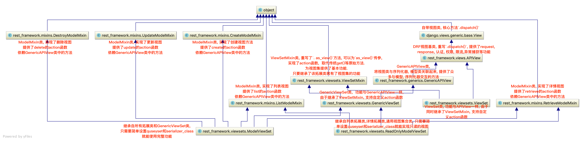

# DRF - Django Rest Framework学习

[toc]

## 1. RESTful

**REST全称Representational State Transfer**, 翻译为**表现层状态转化**, 由Roy Thomas Fielding在2000年提出

REST是一种软件架构的风格, 满足这些写约束条件和原则的应用程序或者设计就是RESTful. 

**RESTful是一种架构风格而不是标准**

> 我的理解REST就是一个URL对应一个资源, 通过HTTP动词+URL来让服务器发生状态转化, 增删改查这个资源.

### 1.1 RESTful设计方法

#### 1.1.1 域名

- 应该讲API部署在专用域名之下

    ```
    https://api.example.com
    ```

- 如果确定API很简单, 不会有进一步的拓展, 可以考虑放在主域名下

    ```
    https://example.org/api.
    ```

#### 1.1.2 版本(Versioning)

- 应该将API的版本号添加到URL中

    ```
    http://www.example.com/app/1.0/foo

    http://www.example.com/app/1.1/foo

    http://www.example.com/app/2.0/foo
    ```
    
- 另一种做法是把版本号放在HTTP头信息中, 但不如放在URL方便和直观.

- 因为不同的版本, 可以理解成同一种资源的不同表现形式, 所以应该采用同一个URL.版本号可以在HTTP请求头信息的Accept字段中进行区分

    ```
    Accept: vnd.example-com.foo+json; version=1.0
    Accept: vnd.example-com.foo+json; version=1.1
    Accept: vnd.example-com.foo+json; version=2.0
    ```

#### 1.1.3 路径(Endpoint)

路径又称`终点endpoint`, 便是API的具体网址, 每个网址代表一种资源(resource)

1. 资源作为网址, 只能有**名词**, 不能有**动词**, 而且所有的名词往往与数据库的表名对应

    - Bad

    ```
    /getProducts
    /listOrders
    /retreiveClientByOrder?orderId=1
    ```

    - Good

    ```
    GET /products  将返回所有产品清单
    POST /products  将产品新建到集合
    GET /products/4  将获取产品 4
    PATCH（或）PUT /products/4  将更新产品 4
    ```
2. API中的名词应该使用复数. 无论子资源或者所有资源.
    
    ```
    GET单个产品：http://127.0.0.1:8080/AppName/rest/products/1
    GET所有产品: http://127.0.0.1:8080/AppName/rest/products
    ```

#### 1.1.4 HTTP动词

由于URL中只能使用名词, 将动词部分用HTTP请求方法表示

- GET: 从服务器取出资源(一项或多项)

- POST:在服务器新建一个资源

- PUT: 在服务器更新资源(客户端提供改变后的完整资源)

- DELETE: 从服务器删除资源

还有是哪个不常用的HTTP动词

- PATCH: 在服务器更新资源

- HEAD: 获取资源的元数据(例如图片的像素)

- OPTIONS: 获取信息, 关于资源的那些属性是客户端可以改变的

    ```
    GET /zoos：列出所有动物园
    POST /zoos：新建一个动物园（上传文件）
    GET /zoos/ID：获取某个指定动物园的信息
    PUT /zoos/ID：更新某个指定动物园的信息（提供该动物园的全部信息）
    PATCH /zoos/ID：更新某个指定动物园的信息（提供该动物园的部分信息）
    DELETE /zoos/ID：删除某个动物园
    GET /zoos/ID/animals：列出某个指定动物园的所有动物
    DELETE /zoos/ID/animals/ID：删除某个指定动物园的指定动物
    ```

#### 1.1.5 过滤信息(Filtering)

如果记录数量很多, API应该提供参数, 过滤返回的结果

- 一些常见的参数(查询字符串)

    ```
    ?limit=10：指定返回记录的数量
    ?offset=10：指定返回记录的开始位置。
    ?page=2&per_page=100：指定第几页，以及每页的记录数。
    ?sortby=name&order=asc：指定返回结果按照哪个属性排序，以及排序顺序。
    ?animal_type_id=1：指定筛选条件
    ```

- 参数的设置允许存在冗余, 允许API路径和URL参数偶尔有重复. 

    ```
    /zoos/ID/adnimals
    /animals?zoo_id=ID 两者含义相同
    ```

#### 1.1.6 状态码(Status Codes)

服务器向用户返回的状态码和提示信息, 常见的有以下一些

```
- 200 OK - [GET]：服务器成功返回用户请求的数据

- 201 CREATED - [POST/PUT/PATCH]：用户新建或修改数据成功。

- 202 Accepted - [*]：表示一个请求已经进入后台排队（异步任务）

- 204 NO CONTENT - [DELETE]：用户删除数据成功。

- 400 INVALID REQUEST - [POST/PUT/PATCH]：用户发出的请求有错误，服务器没有进行新建或修改数据的操作
401 Unauthorized - [*]：表示用户没有权限（令牌、用户名、密码错误）。

- 403 Forbidden - [*] 表示用户得到授权（与401错误相对），但是访问是被禁止的。

- 404 NOT FOUND - [*]：用户发出的请求针对的是不存在的记录，服务器没有进行操作，该操作是幂等的。

- 406 Not Acceptable - [GET]：用户请求的格式不可得（比如用户请求JSON格式，但是只有XML格式）。

- 410 Gone -[GET]：用户请求的资源被永久删除，且不会再得到的。

- 422 Unprocesable entity - [POST/PUT/PATCH] 当创建一个对象时，发生一个验证错误。

- 500 INTERNAL SERVER ERROR - [*]：服务器发生错误，用户将无法判断发出的请求是否成功。
```

详见[维基百科](https://zh.wikipedia.org/wiki/HTTP%E7%8A%B6%E6%80%81%E7%A0%81)

#### 1.1.7 错误处理(Error handling)

如果状态码是4xx, 服务器就应该向用户返回出错信息, 一般来说, 返回的信息中将"error"作为键名, 出错信息作为值.

#### 1.1.8 返回结果

针对不同的操作, 服务器向用户返回的结果应该符合以下规范

- GET /collection: 返回资源对象的列表(数组)

- GET /collection/resource: 返回单个资源对象

- POST /collection: 返回新生成的资源对象

- PUT /collection/resource: 返回完整的资源对象

- PATCH /collection/resource: 返回完整的资源对象

- DELETE /collection/resource: 返回一个空文档

#### 1.1.9 超媒体(Hypermedia API)

RESTful API最好做到`Hypermedia`, 即返回结果中提供链接, 连向其他的API方法, 使得用户不查文档也知道下一步应该做什么.

比如[api.github.com](https://api.github.com)

#### 1.1.10 返回值

尽量使用JSON

### 1.2 设计RESTful API的核心任务

在开发REST API接口时, 视图中做的最主要的三件事是:

- 将请求的数据(如JSON)转换为模型类对象

- 操作数据库

- 将模型类对象转换为响应的数据(如JSON)

这个过程可以理解为**序列化**和**反序列化**, 在开发REST API时, 在视图中要平凡的进行序列化与反序列化的编写.

> Django模型 -> JSON 序列化
>
> JSON -> Django模型 反序列化

序列化的定义:

**序列化**`serialization`, 在计算机科学的资料处理中, 是指将数据结构或物件转化结构或物件状态转换成可取用的格式(例如存成档案, 存于缓冲, 或经由网络中传送), 以后续在相同或另一台计算机环境中, 能恢复原先状态的过程. 依照序列化格式重新获取字节的结果时, 可以利用他来产生于原始物件相同语义的副本. 

对于许多物件, 像是使用大量参照的复杂物件, 这种序列化重建的过程并不容易. 面向对象中的物件序列化, 并不概括之前原始物件所关联的函式. 这种过程也成为物件的编组(`marshaling`).

从一系列字节提取数据结构的反向操作, 是**反序列化**`deserialization`(也成为解编组`unmarshaling`)

> Python中的pickle模块可以用于序列化数据, 而shelef模块依赖于pickle, 可以将Python对象永久化保存到硬盘中.

<br>
<br>
<br>

> QUESTIONS:
 
> 1. 怎么做到输出据部分数据, marshal功能? -> class Meta: field, 如果做到根据不同权限去显示呢?
>
> 2. 怎么在序列化时自定义键值对的**键** - > source参数
>
> 3. 怎么在序列化前对数据进行加工? 比如获得了URL,  但实际上需要加前缀 -> 
>
> 4. 当构建序列化器对象时传入QuerySet, data中是OrderedDict 怎么转化为JSON数据 -> 可以直接json.dumps()

## 2. DRF模块 Django REST Framework简介

Django REST Framework是Django的一个插件, 需要单独安装

它可以帮助我们简化序列化和反序列的过程, 也帮助我们完成了与数据库的交互, 甚至还可以帮助完成参数的验证. 大大提高了REST API的开发速度.

其特点为:

- 提供了定义序列化器`Serializer`方法, 可以快速根据Django ORM或者其他库自动序列化/反序列化

- 提供了丰富的类视图, Mixin拓展类, 简化视图的编写

- 丰富的定制层级: 视图函数, 类视图, 视图集合到自动生成API, 满足各种需求

- 多种身份认真和权限认证方式的支持

- 内置了限流系统

- 直观的API web界面

- 可拓展性, 插件丰富

[官方网站](https://www.django-rest-framework.org/)

> 非常强大的插件, 集成度十分高, 对比之下Flask中的插件逊色不少. DRF作为Django的插件, 自身也有不少插件.

### 2.1 DRF工程搭建

1. 安装DRF
    
    ```sh
    pip install djangorestframework
    ```

2. 添加`rest_framework`应用

    ```python
    # setting.py
    INSTALLED_APPS = [
        ...,
        'rest_framework',
    ]
    ```

配置成功

### 2.2 使用DRF极速开发REST API

只需要三步

1. 创建序列化器

    - 在子应用中创建`serializer.py`文件

    ```python
    from rest_framework import serializers

    class BookSerializer(serializers.ModelSerializer):
        """不要继承错了!"""
        class Meta:
            # model 指明该序列化器处理的数据字段从模型类BookInfo参考生成
            model = BookInfo
            # fields 指明该序列化器包含模型类中的哪些字段，'__all__'指明包含所有字段
            fields = '__all__'
    ```

2. 编写视图

    - 在子应用的`views.py`中编辑

    ```python
    from rest_framework.viewsets import ModelViewSet
    from .serializers import BookSerializer
    from .models import BookInfo

    
    class BookInfoViewSet(ModelViewSet):
        #  指明该视图集在查询数据时使用的查询集
        queryset = BookInfo.objects.all()

        #  指明该视图在进行序列化或反序列化时使用的序列化器
        serializer_class = BookSerializer
    ```

3. 定义路由

    - 在子应用的`urls.py`中编辑, 没有就创建

    ```python
    from django.conf.urls import url
    from .views import *
    from rest_framework.routers import DefaultRouter

    app_name = "bookset"

    urlpatterns = []

    router = DefaultRouter()  # 可以处理视图的路由器

    router.register(r'book', viewset=BookInfoViewSet)  # 向路由器中注册视图集

    urlpatterns += router.urls
    ```

运行程序, 进入API页面, 有图形化的管理界面, 简直太酷了! 居然还是超媒体的! 会把所有的API都显示出来, 可以进一步操作.

使用POSTMAN测试居然返回正常的JSON数据!

应该是对请求做判断了, 分析是不是浏览器的请求

<br>
<br>
<br>

## 3. Serializer序列化器

序列化器的作用: 

1. 数据校验

2. 数据/对象转化

### 3.1 定义Serializer

#### 3.1.1 定义方法

DRF框架中想定义一个序列化器, 必须继承自`rest_framework.serializers.Serializer`类

- model (`model._meta.fields`可以取到模型所有的字段信息)

    ```python
    class BookInfo(models.Model):
        btitle = models.CharField(max_length=20, verbose_name='名称')
        bpub_date = models.DateField(verbose_name='发布日期', null=True)
        bread = models.IntegerField(default=0, verbose_name='阅读量')
        bcomment = models.IntegerField(default=0, verbose_name='评论量')
        image = models.ImageField(upload_to='booktest', verbose_name='图片', null=True)
    ```

- 为model创建Serializer

    ```python
    class BookInfoSerializer(serializers.Serializer):
        """图书数据序列化器"""
        id = serializers.IntegerField(label='ID', read_only=True)
        btitle = serializers.CharField(label='名称', max_length=20)
        bpub_date = serializers.DateField(label='发布日期', required=False)
        bread = serializers.IntegerField(label='阅读量', required=False)
        bcomment = serializers.IntegerField(label='评论量', required=False)
        image = serializers.ImageField(label='图片', required=False)
    ```

> 真的很像WTForms里面的定义验证器的格式, 这些模块基本都是一个套路, 只不过RDF模块中的序列化器封装的更好, 验证只是它提供的一个小功能.(Django中也有表单验证的功能吧)

**需要注意的是, 序列化器不仅可以能为数据库模型类定义, 也可以为非数据库模型类的数据定义.** 只不过定义序列化器和定义模型类有点相似.

将序列化器中的的类属性名称需要和模型中的属性名称对应, 这样序列化时的才知道到底对应的是那个值.

> 如果自定义序列化时的**键**的值, 只能使用默认的么?

- 官方教程上的例子(Non-ORM)

    ```python
    from datetime import datetime

    class Comment(object):
        def __init__(self, email, content, created=None):
            self.email = email
            self.content = content
            self.created = created or datetime.now()

    comment = Comment(email='leila@example.com', content='foo bar')

    from rest_framework import serializers

    class CommentSerializer(serializers.Serializer):
        email = serializers.EmailField()
        content = serializers.CharField(max_length=200)
        created = serializers.DateTimeField()
    
    serializer = CommentSerializer(comment)
    serializer.data
    # {'email': 'leila@example.com', 'content': 'foo bar', 'created': '2016-01-27T15:17:10.375877'}
    ```

#### 3.1.2 字段与选项

- 常用字段 - Filed子类

    |字段|字段构造方式|
    |---|---|
    |BooleanField|BooleanField()|
    |NullBooleanField|NullBooleanField()|
    |CharField|CharField(max_length=None, min_length=None, allow_blank=False, trim_whitespace=True)|
    |EmailField|EmailField(max_length=None, min_length=None, allow_blank=False)|
    |RegexField|RegexField(regex, max_length=None, min_length=None, allow_blank=False)|
    |SlugField|SlugField(maxlength=50, min_length=None, allow_blank=False) 正则字段，验证正则模式 [a-zA-Z0-9-]+|
    |URLField|URLField(max_length=200, min_length=None, allow_blank=False)|
    |UUIDField|UUIDField(format='hex_verbose') format: <br> 1) 'hex_verbose' 如"5ce0e9a5-5ffa-654b-cee0-1238041fb31a"<br> 2） 'hex' 如 "5ce0e9a55ffa654bcee01238041fb31a" <br> 3）'int' - 如: "123456789012312313134124512351145145114" <br>  4）'urn' 如: "urn:uuid:5ce0e9a5-5ffa-654b-cee0-1238041fb31a"|
    |IPAddressField|IPAddressField(protocol='both', unpack_ipv4=False, **options)|
    |IntegerField|IntegerField(max_value=None, min_value=None)|
    |FloatField|FloatField(max_value=None, min_value=None)|
    |DecimalField|DecimalField(max_digits, decimal_places, coerce_to_string=None, max_value=None, min_value=None) - max_digits: 最多位数 - decimal_palces: 小数点位置|
    |DateTimeField|DateTimeField(format=api_settings.DATETIME_FORMAT, input_formats=None)|
    |DateField|DateField(format=api_settings.DATE_FORMAT, input_formats=None)|
    |TimeField|TimeField(format=api_settings.TIME_FORMAT, input_formats=None)|
    |DurationField|DurationField()|
    |ChoiceField|ChoiceField(choices) choices与Django的用法相同|
    |MultipleChoiceField|MultipleChoiceField(choices)|
    |FileField|FileField(max_length=None, allow_empty_file=False, use_url=UPLOADED_FILES_USE_URL)|
    |ImageField|ImageField(max_length=None, allow_empty_file=False, use_url=UPLOADED_FILES_USE_URL)|
    |ListField|ListField(child=, min_length=None, max_length=None)|
    |DictField|DictField(child=)|

- 选项参数 - 通常用于数字和字符串相关的Field子类, 详见文档

    |参数名称|作用|
    |---|---|
    |max_length|最大长度|
    |min_lenght|最小长度|
    |allow_blank|是否允许为空|
    |trim_whitespace|是否截断空白字符|
    |max_value|最小值|
    |min_value|最大值|

- 通用参数, 定义在Field中, 每一个Field子类都可以设置

    |参数名称|说明|
    |---|---|
    |read_only|表明该字段仅用于序列化输出，默认False, 一般主键可以设为只读|
    |write_only|表明该字段仅用于反序列化输入，默认False|
    |required|表明该字段在反序列化时必须输入，默认True|
    |default|反序列化时使用的默认值|
    |allow_null|表明该字段是否允许传入None，默认False|
    |validators|该字段使用的验证器|
    |error_messages|包含错误编号与错误信息的字典|
    |label|用于HTML展示API页面时，显示的字段名称|
    |help_text|用于HTML展示API页面时，显示的字段帮助提示信息|

#### 3.1.3 创建Serializer对象

- 创建对象

    ```python
    ser = Serializer(instance=None, data=empty, **kwargs)
    ```

参数说明:

1. 用于序列化时, 将模型类对象传入**instance**参数

2. 用于反序列化是, 将要被反序列化的数据传入**data**参数
<span id="serializer_context"></span>
3. 除了instance和data参数外, 在构造Serializer对象时, 还可以通过**context**参数额外添加数据
    
    ```python
    # 能通过
    serializer = AccountSerializer(account, context={'request': request})
    ```
    
    - 通过context参数附加的数据, 可以通过实例的`context`属性获取.

4. **partial**, 如果只是想更新部分数据的时候指定该参数为True, 后面会提到.

5. **many**, 如果传入的是`QuerySet`, 有多个模型实例, 则指定该参数为True, 后面会提到.

> 请注意在创建对象时data=empty, 这个是一个有默认值的参数, empty是DRF定义的一个类, 这个类没有实现任何的方法, 在初始化时会判断`data is not empty`, 判断empty的值有没有被传入新的参数. 为什么不直接判断为`None`? 有的时候`None`也是一个有效的输入, 因此要新定义一个类专门用来判断是否传参.
>
> 这是一个很好的思路, 如果下次遇到类似该需求也可以定义一个类, 使用`is`来判断是否传参了.

<br>

### 3.2 序列化使用

序列化: 模型 -> 数据

#### 3.2.1 基本使用

1. 获得模型
    
    ```python
    from booktest.models import BookInfo

    book = BookInfo.objects.get(id=2)
    ```

2. 构造序列化器对象

    ```python
    from booktest.serializers import BookInfoSerializer

    serializer = BookInfoSerializer(book) 
    ```

3. 获得序列化数据

    ```python
    serializer.data
    # 获得序列化后结果
    # {'id': 2, 'btitle':'xxx', 'bpub_date': 'xxxx-xx-xx', ...}
    ```

4. 如果传入的是`QuerySet`需要在构造序列化器时指定`many=True`

    ```python
    book_qs = BookInfo.objects.all()
    serializer = BookInfoSerializer(book_qs, many=True)
    serializer.data
    # 得到的OrderedDict对象
    ```

#### 3.2.2 关联对象嵌套序列化

如果需要序列化的数据中包含有其他**关联对象**, 则对关联对象数据的序列化需要指明.

- 在之前定义的模型中`书本`和`英雄人物`是**一对多**的关系, 因此如何将`英雄人物`中的**外键**也进行序列化呢?

    - 根据英雄人物模型创建英雄人物的序列化器

    ```python
    class HeroInfoSerializer(serializers.Serializer):
        """英雄人物数据序列化器"""
        GENDER_CHOICES = (
            (0, 'male'),
            (1, 'female')
        )
        id = serializers.IntegerField(label='ID', read_only=True)
        hname = serializers.CharField(label='名字', max_length=20)
        hgender = serializers.ChoiceField(choices=GENDER_CHOICES, label='性别', required=False)
        hcomment = serializers.CharField(label='描述信息', max_length=200, required=False, allow_null=True)
    ```

现在外键的信息是查询不到的, 对于添加关联字段可以采用以下几种方式:

1. **PrimaryKeyRelatedField**

    - 该字段(Field)将被序列化为关联对象的**主键**

    ```python
    # 在HeroInfoSerializer中添加
    hbook = serializers.PrimaryKeyRelatedField(label="图书", read_only=True)

    # 或者
    hbook = serializers.PrimaryKeyRelatedField(label='图书', queryset=BookInfo.objects.all())
    ```
    
    - 注意: 如果不指定`queryset`特定的值, 就必须设置`read_only`为`True`.
    
    - 原因: 除非外键id是只读的, 如果想要对这个数据进行修改, 则必须设置`query_set`来验证修改后的外键是否有效.

    ```python
    hero = HeroInfo.objects.get(id=6)
    serializer = HeroInfoSerializer(hero)
    serializer.data
    # {'id': 6, 'hname': 'xx', 'hgender': 1, 'hcomment': 'xxxx', 'hbook': 2}  hbook为model中hbook_id这个隐藏字段
    ```

2. **StringRelatedField**

    - 该字段将被序列为关联对象的**字符串表现方式**(`__str__`方法的返回值)

    ```python
    # 在HeroInfoSerializer中添加
    hbook = serializers.StringRelatedField(label='图书')

    # 结果 {'id':6, ... , 'hbook': 'bookname' }
    ```

3. **SlugRelatedField**

    - 此字段将被序列化为关联对象内的**指定字段**数据

    ```python
    hbook = serializers.SlugRelatedField(label='图书', read_only=True, slug_field='bpub_date')
    # 这样就会显示关联模型的bpub_date字段保存的信息了
    # {...'hbook': datetime.date(xxxx, x, xx)}
    ```

4. 直接只用关联对象的序列化器

    ```python
    hbook = BookInfoSerializer()

    # 效果 {...., 'hbook': OrderedDict([('id', 2),('btitle', 'xxx'), (xx, xx)...]) }
    ```

上面都是在**多**的模型中添加**一**的模型的关联数据, 反之设置的方法都是一样的. 

- 只要在字段中传入参数`many=True`

    ```python
    class BookInfoSerializer(serializers.Serializer):
        .....
        # 那PrimaryKeyRelatedField举个例子
        # 注意这个也是个隐藏属性, 是设置了外加了之后自动生成的
        heroinfo_set = serializers.PrimaryKeyRelatedField(read_only=True, many=True)
    ```

<br>

### 3.3 反序列化使用

反序列化: 数据 -> 模型

先验证再生成模型

#### 3.3.1 验证

在定义序列化器时, 指明每个字段的序列化类型和选项参数, 这是第一道认证(后面还能添加自定义的验证器), 只有满足字段设置的条件才可以验证通过.

验证步骤:

1. 反序列化时传入data参数构建序列化器实例.

2. 调用`.is_valid()`方法, 验证成功返回`True`, 错误返回`False`. 该方法还可以接受参数`raise_exception`, 设置为`True`时验证失败时抛出`ValidationError`异常

    ```python
    # 该异常被DRF框架捕获, 最终返回400
    # Return a 400 response if the data was invalid.
    serializer.is_valid(raise_exception=True)
    ```

3. 验证成功, `validated_data`属性获取验证后的数据. 

4. 验证失败, `errors`属性获取错误信息(字典类型, 包含了字段和字段发生的错误, 如果是非字段的错误, 可以通过配置`NON_FIELD_ERRORS_KEY`来指定非字段错误键名)

    ```python
    from booktest.serializers import BookInfoSerializer
    data = {'bpub_date': 123}
    serializer = BookInfoSerializer(data=data)
    serializer.is_valid()  # 返回False
    serializer.errors
    # {'btitle': [ErrorDetail(string='This field is required.', code='required')], 'bpub_date': [ErrorDetail(string='Date has wrong format. Use one of these formats instead: YYYY[-MM[-DD]].', code='invalid')]}
    serializer.validated_data  # {}
    
    data = {'btitle': 'python'}
    serializer = BookInfoSerializer(data=data)
    serializer.is_valid()  # True
    serializer.errors  # {}
    serializer.validated_data  #  OrderedDict([('btitle', 'python')])
    ```

除此以外, 还能够**自定义验证器** , 来做进一步的验证.

有以下三种方式添加一个自定义的验证器:

1. 在自定义序列化器中添加验证函数

    - 验证的函数名固定`validate_<field_name>`, 指明了要验证的字段后, 验证器会自动进行验证

    - 和WTF自定义验证器一个套路, 只不过最后要**返回验证通过的值**
    
    ```python
    class BookInfoSerializer(serializers.Serializer):
        """图书数据序列化器"""
        ...

        def validate_btitle(self, value):
            """验证传入的数名中是否有django"""
            if 'django' not in value.lower():
                raise serializers.ValidationError("图书不是关于Django的")
            return value
    ```

    - 该方法的缺点是只能对单个字段的数据进行验证


2. 字段(Filed)接受参数`validators`, 可以传入验证器函数的列表(可以添加多个验证器)

    - 验证失败必须抛出`serializers.ValidationError`异常

    ```python
    def about_django(value):
        if 'django' not in value.lower():
            raise serializers.ValidationError("图书不是关于Django的")

    class BookInfoSerializer(serializers.Serializer):
        ...
        btitle = serializers.CharField(label='名称', max_length=20, validators=[about_django])
        ...
    ```

2. 重写父类`.validate()`方法

    - 该方法也是会自动验证, 参数`attrs`的值就是构建实例时的`data`参数, 最后需要将验证后的`attrs`返回(父类中该方法直接把attrs返回了, 没有做任何判断, 因此重写该方法)

    - 由于这个验证器和任何一个字段都没有关系, 因此在抛出异常时就会`error`的键是`non-field-error`, 配置`NON_FIELD_ERRORS_KEY`来指定非字段错误键名.

    ```python
    class BookInfoSerializer(serializers.Serializer):
        """图书数据序列化器"""
        ...

        def validate(self, attrs):
            bread = attrs['bread']
            bcomment = attrs['bcomment']
            if bread < bcomment:
                raise serializers.ValidationError('阅读量小于评论量')
            return attrs
    ```

#### 3.3.2 生成模型并保存

在验证成功后, 基于验证过的数据可以创建模型对象并保存, 只不过我们需要手动实现`.create()`和`.update()`方法.

> 如果序列化器继承自`ModelSerializer`会直接关联到`Model`, 同时也实现了这些方法.

- 创建/更新模型对象

    ```python
    class BookInfoSerializer(serializers.Serializer):
        """图书数据序列化器"""
        ...

        def create(self, validated_data):
            """新建"""
            return BookInfo(**validated_data)
            
        def update(self, instance, validated_data):
            """更新，instance为要更新的对象实例"""
            instance.btitle = validated_data.get('btitle', instance.btitle)
            instance.bpub_date = validated_data.get('bpub_date', instance.bpub_date)
            instance.bread = validated_data.get('bread', instance.bread)
            instance.bcomment = validated_data.get('bcomment', instance.bcomment)
            return instance
    ```

这样就可以创建/更新模型实例了, 可以拿到实例之后调用`模型实例.save()`方法保存到数据库中

- 创建/更新模型对象 + 自动保存到数据库

    ```python
    class BookInfoSerializer(serializers.Serializer):
        """图书数据序列化器"""
        ...

        def create(self, validated_data):
            """新建"""
            return BookInfo.objects.create(**validated_data)

        def update(self, instance, validated_data):
            """更新，instance为要更新的对象实例"""
            instance.btitle = validated_data.get('btitle', instance.btitle)
            instance.bpub_date = validated_data.get('bpub_date', instance.bpub_date)
            instance.bread = validated_data.get('bread', instance.bread)
            instance.bcomment = validated_data.get('bcomment', instance.bcomment)
            instance.save()
            return instance
    ```

实现了这两个方法后, 可以使用序列化器的`.save()`方法获得模型实例

```python
data = {'btitle': 'python'}
serializer = BookInfoSerializer(data=data)
serializer.is_valid()  # True
book = serializer.save()
```

我们完全不需要**手动调用** `.create()`和`.update()`方法, 只需要调用`save()`方法就可以了, 在父类中的`.save()`方法会做一个判断:

- 如果在构造序列化器实例的时候只传入了`data`, 则调用`.create()`方法创建一个模型实例

- 如果在构造序列化器实例的时候即传入了`data`, 又传入了`instance`, 则会调用`.update()`方法更新一个模型实例

> 我们也可以重写`.save()`方法(见官方网站)

额外说明:

1. 在调用`.save()`方法时, 可以额外传递数据, 这些数据可以在`.create()`和`.update()`中的`validated_data`参数获取到

    ```python
    serializer.save(user_name="xiaoming")
    ```

2. 序列化器必须传递所有的设置了`required`字段, 否则会在验证时会抛出异常, 如果只需要更新部分数据, 可以通过构建序列化器时传入`partial`参数

    ```python
    # 官方网站的例子.
    serializer = CommentSerializer(comment, data={'content': u'foo bar'}, partial=True)
    ```

<br>

### 3.4 模型类序列化器

牛逼的来了, 刚才创建的序列化器需要通过大量的设置去序列化一个模型的数据, 现在有了**模型类序列化器** `ModelSerializer`, 可以一键关联需要序列化的模型类.

`ModelSerializer`类继承自`Serializer`类, 但是它提供了:

- 基于模型类自动生成一系列字段

- 基于模型类自动为`Serializer`生成`validators`, 比如`unique_together`

- 包含默认的`create()`和`update()`实现

#### 3.4.1 定义

- 通过简单的设置关联模型

    ```python
    class BookInfoSerializer(serializers.ModelSerializer):
        """图书的模型序列化器"""
        class Meta:
            model = BookInfo # 关联的模型类对象
            fields = '__all__'  # 需要显示的字段
    
    # 根据模型为我们自动创建的序列化器类
    # BookInfoSerializer():
    # id = IntegerField(label='ID', read_only=True)
    # btitle = CharField(label='名称', max_length=20)
    # bpub_date = DateField(allow_null=True, label='发布日期', required=False)
    # bread = IntegerField(label='阅读量', max_value=2147483647, min_value=-2147483648, required=False)
    # bcomment = IntegerField(label='评论量', max_value=2147483647, min_value=-2147483648, required=False)
    # image = ImageField(allow_null=True, label='图片', max_length=100, required=False)
    ```

#### 3.4.2 指定字段

1. 使用**fields**来确定**需要被序列化**和**验证**的字段, `__all__`显示模型所有字段

    ```python
    class BookInfoSerializer(serializers.ModelSerializer):
        class Meta:
            model = BookInfo
            fields = ('id', 'btitle', 'bpub_date')
    ```

2. 使用**exclude**反向选择

    ```python
    class BookInfoSerializer(serializers.ModelSerializer):
        class Meta:
            model = BookInfo
            exclude = ('image',)
    ```

3. 在多对一关系中, `ModelSerializer`默认使用`PrimaryKeyRelatedField`来作为关联字段, 可以使用**depth**来简单生成嵌套表示, depth应该是整数, 表名嵌套层级

    ```python
    class HeroInfoSerializer(serializers.ModelSerializer):
        class Meta:
            model = HeroInfo
            fields = '__all__'
            depth = 1

    # 形成的序列化器如下
    # HeroInfoSerializer():
    # id = IntegerField(label='ID', read_only=True)
    # hname = CharField(label='名称', max_length=20)
    # hgender = ChoiceField(choices=((0, 'male'), (1, 'female')), label='性别', required=False, validators=[<django.core.valators.MinValueValidator object>, <django.core.validators.MaxValueValidator object>])
    # hcomment = CharField(allow_null=True, label='描述信息', max_length=200, required=False)
    # hbook = NestedSerializer(read_only=True):
    #    id = IntegerField(label='ID', read_only=True)
    #    btitle = CharField(label='名称', max_length=20)
    #    bpub_date = DateField(allow_null=True, label='发布日期', required=False)
    #    bread = IntegerField(label='阅读量', max_value=2147483647, min_value=-2147483648, required=False)
    #   bcomment = IntegerField(label='评论量', max_value=2147483647, min_value=-2147483648, required=False)
    #   image = ImageField(allow_null=True, label='图片', max_length=100, required=False)
    ```

4. 也可以指定关联属性显示指定字段

    ```python
    class HeroInfoSerializer(serializers.ModelSerializer):
        # BookInfoSerializer中需要显示什么字段自己定义
        hbook = BookInfoSerializer()

        class Meta:
            model = HeroInfo
            fields = ('id', 'hname', 'hgender', 'hcomment', 'hbook')
    ```

4. 指明只读字段

    - 可以通过**read_only_field**, 指明只读字段, 即仅用于序列化输出的字段

    ```python
    class BookInfoSerializer(serializers.ModelSerializer):
        class Meta:
            model = BookInfo
            fields = ('id', 'btitle', 'bpub_date'， 'bread', 'bcomment')
            read_only_fields = ('id', 'bread', 'bcomment')
    ```

#### 3.4.3 添加格外参数(验证参数)

可以看见, 现在由于自动生成的字段, 所有的验证参数都是根据模型类中的字段去自动生成的, 我们迫切需要自己添加一些验证参数.

- 可以使用**extra_kwargs**参数为来修改自动生成的验证参数. 需要注意它是一个字典, 内部以键值对的方式设置参数.

    ```python
    class BookSerializer(serializers.ModelSerializer):
        class Meta:
            model = BookInfo
            fields = ('id', 'btitle', 'bpub_date', 'bread', 'bcomment')
            extra_kwargs = {
                'bread':{'min_value':0, 'required':True},
                'bcomment':{'min_value':0, 'required':True},
            }
    # 这样就修改了字段的某个验证参数
    # 注意原来的bread按照MySQL中的Integer类型来生成, 范围是-2147483648到2147483648.
    ```

> 真的是太好用了!

<br>
<br>
<br>

> QUESTIONS:
> 
> 1. SimpleRouter和DefaultRouter
> 
> 2. 拒绝式攻击
> 
> 3. 验证, 限流, 权限, 如果不设置使用设置中的, 如果设置了?

## 4. 视图

### 4.1 Request与Response

#### 4.1.1 Request

DRF传入视图的request对象不再是Django默认的`HTTPRequest`对象, 而是DRF提供的拓展的`Request`类的对象

> 如果想使用`Request`对象, 必须使用`@api_view([请求方法])`, 或者使用类视图继承自`APIView`或其子类
>
> 主要是要让DRF框架对原始request进行加工

DRF提供了**Parser**解析器, 在接收到请求后会自动根据Content-Type指明的请求数据类型(如JSON, 表单数据), 将请求数据进行解析, 保存到Request对象中

**Request中常用的属性**

1. `.data`

    `.data`返回解析之后的请求体数据. 类似于Django中的`.POST`和`.FILES`属性, 而且提供以下特性:

    - 包含了解析之后的文件父非文件数据

    - 包含了对POST, PUT, PATCH请求方式解析后的数据

    - 利用了DRF的parsers解析器, 不仅支持表单类型数据, 也支持JSON数据

2. `.query_params`

    等同于`request.GET`, 只不过换了一个正确的名字

#### 4.1.2 Response

DRF提供了一个响应类`Response`, 使用该类构造响应对象时, 响应的具体数据内容会被转换(render渲染)成符合前端需求的类型.

如果返回Response对象, 并且传入了`data=`, 使用浏览器访问api网址, 会返回一个末班网页, 因为`Response`继承自`django.template.response`中的`SimpleTemplateResponse`类, 但是如果指明了`Accept`为`application/json`则只会收到JSON数据.

> 当然也需要继承自`APIView`子类或者是用`@api_view()`装饰器

DRF提供了`Renderer`渲染器, 用来根据请求头的`Accept`来自动转换响应数据到对应格式. 如果前端没有添加`Accept`申明, 则会采用默认方式来处理响应数据.

- 可以通过配置来修改默认响应格式

    ```python
    REST_FRAMEWORK = {
        'DEFAULT_RENDERER_CLASSES': (  # 默认响应渲染类
            'rest_framework.renderers.JSONRenderer',  # json渲染器
            'rest_framework.renderers.BrowsableAPIRenderer',  # 浏览API渲染器
        )
    }
    ```

> `rest_framework.renderers`模块中定义了很多渲染器, 我们也可以手动去渲染数据, 比如`JSONRenderer`, 但是如果使DRF的`Response`类构建响应对象的时候就不能去手动渲染了.

- 构造`Response`对象的方法
    
    ```python
    Response(data, status=None, template_name=None, headers=None, content_type=None)
    ```

由于`data`不能传入渲染好的数据, 就可以传入Python自带类型的数据即可, DRF会自己处理.

> `data`还不能是复杂的数据结构(如Django的模型对象), 所以一般都是传入使用序列化器处理好的数据

参数说明:

- `data`: 为响应准备的序列化处理后的数据

- `status`: 状态码, 默认200

- `template_name`: 模板名称, 如果使用`HTMLRenderer`时需指明?

- `headers`: 用于存放响应头信息的字典

- `content_type`: 响应数据的Content-Type, 通常此参数无需传递, REST framework会根据前端所需类型数据来设置该参数

常用的属性:

- `.data`: 通过`data=`传入的参数, 尚未`render`处理的数据

- `.status_code`: 状态码数字

- `.content`: 经过`render`渲染后的数据

#### 4.1.3 状态码

为了方便设置状态码, DRF在`rest_framework.status`模块中提供了常用的状态码常量.

基本上就是`HTTP_200_OK=200`这样的方式, 以防开发人员忘记具体状态码代表什么含义

<br>

### 4.2 视图概览

DRF提供了众多通用视图基类与拓展类, 以简化视图的编写.

> DRF应该是参考了Django框架中的View设计, 在Django中, 也有丰富的视图类, 高度封装, 可以快速实现功能
> 
> [Django官方教程 - 通用视图](https://docs.djangoproject.com/zh-hans/2.1/topics/class-based-views/)



<br>

### 4.3 视图说明

#### 4.3.1 基类 APIView

**APIView**

> 文件路径: `rest_framework/view.py`

`APIView`是DRF提供的所有视图类的基类, 继承自Django的`View`类.

`APIView`与`View`的不同之处在于:

- 传入视图方法中的是DRF的`Request`对象, 而不是Django的`HttpRequest`对象

- 视图方法可以返回DRF的`Response`对象, 视图会为响应数据设置(render)符合前端要求的格式

- 任何`APIException`异常都会被捕捉到, 并且处理成合适的响应时间

- 在进行`dispatch()`分发前, 会对请求进行身份认证, 权限认证, 流量控制

支持定义的属性:

- `authentication_classes`列表或元组, 身份认证类

- `permission_classes`列表或元组, 权限检查类

- `throttle_classes`列表或元组, 流量控制类

#### 4.3.2 通用API视图 GenericAPIView

> 文件路径`rest_framework/generic.py`

**GenericAPIView**

继承自`APIView`, 增加了对于`列表视图`和`详情视图`可能用到的通用支持方法. 通常使用时, 可以搭配一个或多个`Mixin`拓展类.

> 由于`Mixin`拓展类中大量依赖`GenericAPIView`提供了方法, 因此在使用`Mixin`之前需要继承`GenericAPIView`. 而最后的子类视图则就是将`Mixin`+`GenericAPIView`进行组合继承.

**支持定义的属性:**

- 列表视图与详情视图通用:
    
    - `queryset`列表视图的查询集

    - `serializer_class` 视图使用的序列化器

- 列表视图使用:

    - `pagination_class` 分页控制类

    - `filter_backends` 过滤控制后端

- 详情页使用:

    - `lookup_field`查询单一数据库对象时使用的条件字段, 默认为`pk`

    - `lookup_url_kwarg`查询单一数据是URL中的参数关键字名称, 默认与`look_field`相同

**提供的方法:**

- 列表视图与详情视图通用:

    - `get_queryset(self)`

    返回视图使用的查询集, 是列表视图也详情视图获取数据的基础, 默认返回`queryset`属性, 可以重写

    ```python
    def get_queryset(self):
        user = self.request.user
        return user.accounts.all()
    ```

    - `get_serializer_class(self)`

    返回序列化器类, 默认返回`serializer_class`, 可以重写

    ```python
    def get_serializer_class(self):
        if self.request.user.is_staff:
            # 需要额外导入
            return FullAccountSerializer
        return BasicAccoutSerializer
    ```
    
    - `get_serializer(self,*args,**kwargs)`

    返回序列化器对象, 被其他视图或拓展类使用, 如果在视图中想要获取序列化器对象, 可以直接调用次方法

    > 在提供序列化器对象时, RDF会往对象的context属性补充三个数据`request`, `format`, `view`, 可以在序列化器对象中取到.(context可以传额外的[数据](#serializer_context))

- 详情视图使用:

    - `get_object(self)`返回详情视图所需的模型类数据对象, 默认使用`lookup_field`(pk)参数来过滤`queryset`. 在视图中可以调用该方法获取详情信息的模型类对象.

    > 若详情访问的模型对象不存在, 会返回404
    >
    > 该方法会默认使用APIView提供的`check_object_permissions`方法检查当前对象是否有权限被访问.

    - 如

    ```python
    # url(r'^books/(?P<pk>\d+)/$', views.BookDetaiView.as_view()
    class BookDetailView(GenericAPIView):
        queryset = BookInfo.object.all()
        serializer_class = BookInfoSerializer

        def get(self, request, pk):
            """返回所有书本的数据"""
            # 根据lookup_field, 和lookup_url_kwarg查询, 默认使用pk, 这里也是自动获取的
            book = self.get_object()
            # get_serializer会先调用get_serializer_class, 然后返回正确的序列化器类, 在构造序列化器
            serializer = self.get_serializer(book)
            return Response(serializer.data)
    ```

#### 4.3.2 五个拓展类(拓展GenericAPIView或者其子类)

> 文件路径: `rest_framework/mixins.py`

> 五个拓展类内部方法依赖于`GenericAPIView`中定义的方法, 正如名字所说, 他们都是拓展类, 因此不能单独被继承
>
> 拓展类中的提供的方法都对应了某个`Django`中的方法, 如`list`对应`get`, 而如何让函数能被**正确地调用**, 请参考[试图集](#view_set)

**1 ListModelMixin**

- 提供`list`action, 对应`get()`方法, 快速实现列表视图, 返回200状态码.`list`方法会对数据进行过滤和分页.

    ```python
    class ListModelMixin(object):
        """
        List a queryset.
        """
        def list(self, request, *args, **kwargs):
            # 过滤
            queryset = self.filter_queryset(self.get_queryset())
            # 分页
            page = self.paginate_queryset(queryset)
            if page is not None:
                serializer = self.get_serializer(page, many=True)
                return self.get_paginated_response(serializer.data)
            # 序列化
            serializer = self.get_serializer(queryset, many=True)
            return Response(serializer.data)
    ```

**2 CreateModelMixin**

- 创建视图拓展类, 提供了`create`action, 对应了`post()`方法, 快速实现创建资源的视图, 成功返回201, 如果序列化器数据验证失败, 返回400错误.

    ```python
    class CreateModelMixin(object):
        """
        Create a model instance.
        """
        def create(self, request, *args, **kwargs):
            # 获取序列化器
            serializer = self.get_serializer(data=request.data)
            # 验证
            serializer.is_valid(raise_exception=True)
            # 保存
            self.perform_create(serializer)
            headers = self.get_success_headers(serializer.data)
            return Response(serializer.data, status=status.HTTP_201_CREATED, headers=headers)

        def perform_create(self, serializer):
            serializer.save()

        def get_success_headers(self, data):
            try:
                return {'Location': str(data[api_settings.URL_FIELD_NAME])}
            except (TypeError, KeyError):
                return {}
    ```

**3 RetrieveModelMixin**

- 详情视图拓展类, 提供了`retrieve` action, 对应了`get()`方法, 可以快速实现返回一个存在的数据对象, 不存在返回`404`

    ```python
    class RetrieveModelMixin(object):
        """
        Retrieve a model instance.
        """
        def retrieve(self, request, *args, **kwargs):
            # 获取对象, get_object中会检查对象的权限
            instance = self.get_object()
            # 序列化
            serializer = self.get_serializer(instance)
            return Response(serializer.data)
    ```

**4 UpdateModelMixin**

- 更新视图拓展类, 提供了`update`的action, 对应了`put()`方法, 可以快速实现更新一个存在的数据对象.如果反序列化时数据校验失败返回400错误.

- 同时也提供了`partial_update`方法, 支持部分更新.

    ```python
    class UpdateModelMixin(object):
        """
        Update a model instance.
        """
        def update(self, request, *args, **kwargs):
            partial = kwargs.pop('partial', False)
            instance = self.get_object()
            serializer = self.get_serializer(instance, data=request.data, partial=partial)
            serializer.is_valid(raise_exception=True)
            self.perform_update(serializer)

            if getattr(instance, '_prefetched_objects_cache', None):
                # If 'prefetch_related' has been applied to a queryset, we need to
                # forcibly invalidate the prefetch cache on the instance.
                instance._prefetched_objects_cache = {}

            return Response(serializer.data)

        def perform_update(self, serializer):
            serializer.save()

        def partial_update(self, request, *args, **kwargs):
            kwargs['partial'] = True
            return self.update(request, *args, **kwargs)
    ```

**5 DestroyModelMixin**

- 删除视图拓展类, 提供了`destroy`的action, 对应`delete()`方法, 可以快速实现删除一个存在的数据对象. 不存在返回4040, 成功返回204

    ```python
    class DestroyModelMixin(object):
        """
        Destroy a model instance.
        """
        def destroy(self, request, *args, **kwargs):
            instance = self.get_object()
            self.perform_destroy(instance)
            return Response(status=status.HTTP_204_NO_CONTENT)

        def perform_destroy(self, instance):
            instance.delete()
    ```
	
	- 该删除为物理删除, 注意重写

> 拓展类配合`GenericAPIView`类最好用, 傻瓜设置

#### 4.3.3 几个可(没)用子类视图

子类视图都继承自`GenericAPIView`然后根据不同的功能去继承不同的**拓展类**

其实子类视图就是将拓展类中的`action`函数`list`, `create`包装成Django普通类视图中的`get`, `post`等方法

- 举个例子, 这是一个类的源码

    ```python
    class RetrieveUpdateDestroyAPIView(mixins.RetrieveModelMixin,
                                       mixins.UpdateModelMixin,
                                       mixins.DestroyModelMixin,
                                       GenericAPIView):
        """
        Concrete view for retrieving, updating or deleting a model instance.
        仅仅只是把action函数进行了包装.
        """
        def get(self, request, *args, **kwargs):
            return self.retrieve(request, *args, **kwargs)

        def put(self, request, *args, **kwargs):
            return self.update(request, *args, **kwargs)

        def patch(self, request, *args, **kwargs):
            return self.partial_update(request, *args, **kwargs)

        def delete(self, request, *args, **kwargs):
            return self.destroy(request, *args, **kwargs)
    ```

无聊的罗列一下

1. CreateAPIView

    - 提供 `post` 方法

    - 继承自： `GenericAPIView`、`CreateModelMixin`

2. ListAPIView

    - 提供 `get` 方法

    - 继承自：`GenericAPIView`、`ListModelMixin`

3. RetireveAPIView

    - 提供 `get` 方法

    - 继承自: `GenericAPIView`、`RetrieveModelMixin`

4. DestoryAPIView

    - 提供 `delete`方法

    - 继承自：`GenericAPIView`、`DestoryModelMixin`

5. UpdateAPIView

    - 提供 `put` 和 `patch` 方法

    - 继承自：`GenericAPIView`、`UpdateModelMixin`

6. RetrieveUpdateAPIView

    - 提供 `get`、`put`、`patch`方法

    - 继承自： `GenericAPIView`、`RetrieveModelMixin`、`UpdateModelMixin`

7. RetrieveUpdateDestoryAPIView

    - 提供 `get`、`put`、`patch`、`delete`方法

    - 继承自：`GenericAPIView`、`RetrieveModelMixin`、`UpdateModelMixin`、`DestoryModelMixin`
    
<br>

### 4.4 视图集

> 文件路径: `rest_framework/viewsets.py`

视图集顾名思义, 将多个视图类整合成一个集合. 为什么要这么做?

试想一下, 一个类中如果只能定义**一个** `get()` 方法, 如果所有的业务逻辑都要在同一个类去定义, 那么get所有数据和get一条数据必须定义两个类, 为了方便管理业务逻辑, 我们可以使用视图集.

使用视图集ViewSet, 可以将一系列逻辑相关的动作放到一个类中.

- `list()`提供**一组**数据

- `retrieve()`提供**一条**数据

- `create()`创建数据

- `update()`保存数据

- `destory()`删除数据

ViewSet视图集类不再实现`get`, `post`等方法, 而是实现**动作(action)函数**, 如`list`, `create`等

- 视图集只在使用`as_view()`方法的时候, 才会将action动作函数与具体请求方式对应上

    ```python
    class BookInfoViewSet(viewsets.ViewSet):

        def list(self, request):
            ...

        def retrieve(self, request, pk=None):
            ...
    ```

    - 设置路由时, 我们可以如下操作

    ```python
    urlpatterns = [
        url(r'^books/$', BookInfoViewSet.as_view({'get':'list'}),
        url(r'^books/(?P<pk>\d+)/$', BookInfoViewSet.as_view({'get': 'retrieve'})
    ]
    ```

#### 4.4.1 action属性

在视图集中, 可以通过action对象属性来获取当前请求视图集时的action动作是哪个?

- 如

    ```python
    def get_serializer_class(self):
        if self.action == 'create':
            return OrderCommitSerializer
        return OrderDataSerializer
    ```

#### 4.4.2 常用视图集父类

**0. ViewSetMixin**

重写了`as_view()`方法, 是action函数功能的基础.

**1. ViewSet**

继承自`APIView`和`ViewSetMixin`, 作用也与APIView基本类似, 体用了身份认证, 权限校验, 流量管理等, 同时也支持定义action

**2. GenericViewSet**

继承自`GenericAPIView`,`ViewSetMixin`. 作用于GenericAPIView类似, 提供了`get_object`, `get_queryset`等方法便于列表视图与详情信息视图的开发.

**3. ModelViewSet**

继承自`GenericViewSet`和所有的`拓展类`, 提供了增删改查所有方法

**4. ReadOnlyModelViewSet**

继承自`GenericViewSet`, 也继承了`ListModelMixin`, `RetrieveModelMixin`, 提供了查询的功能

#### 4.4.3 视图集中定义附加action动作

`list`, `retrieve`, `create`, `update`, `destory`这几个动作不足以涵盖所有的逻辑处理, 于是, 我们可以自定义action.

添加自定义动作需要使用`rest_framework.decorators.action`装饰器.

`@action()`装饰器可以接受两个参数:

- methods: 该action支持的请求方式, 列表包裹

- detail: 表示action中要处理的是否是视图资源对象(是不是要处理单个模型, 是否从URL中获取主键). `True`代表使用通过URL获取的主键对应的数据对象, `False`表示不适用URL获取主键

- 如:

    ```python
    from rest_framework import mixins
    from rest_framework.viewsets import GenericViewSet
    from rest_framework.decorators import action

    class BookInfoViewSet(mixins.ListModelMixin, mixins.RetrieveModelMixin, GenericViewSet):
        queryset = BookInfo.objects.all()
        serializer_class = BookInfoSerializer

        # detail为False 表示不需要处理具体的BookInfo对象
        @action(methods=['get'], detail=False)
        def latest(self, request):
            """
            返回最新的图书信息
            """
            book = BookInfo.objects.latest('id')
            serializer = self.get_serializer(book)
            return Response(serializer.data)

        # detail为True，表示要处理具体与pk主键对应的BookInfo对象
        @action(methods=['put'], detail=True)
        def read(self, request, pk):
            """
            修改图书的阅读量数据
            """
            book = self.get_object()
            book.bread = request.data.get('read')
            book.save()
            serializer = self.get_serializer(book)
            return Response(serializer.data)
    ```
    
    - 注册url

    ```python
    urlpatterns = [
        url(r'^books/$', views.BookInfoViewSet.as_view({'get': 'list'})),
        url(r'^books/latest/$', views.BookInfoViewSet.as_view({'get': 'latest'})),
        url(r'^books/(?P<pk>\d+)/$', views.BookInfoViewSet.as_view({'get': 'retrieve'})),
        url(r'^books/(?P<pk>\d+)/read/$', views.BookInfoViewSet.as_view({'put': 'read'})),
    ]
    ```

<br>

### 4.5 路由 Routers

以上注册路由的方式还是相对麻烦(手动注册)

对于视图集来说, 我们不仅可以自定义action函数, 还能使用`Routers`来帮助我们快速实现路由信息

DRF提供了两个`Router`类来帮助我们快速创建路由

- `SimpleRouter`

- `DefaultRouter`

> `DefaultRouter`与`SimpleRouter`的区别是, `DefaultRouter`会多附带一个默认的API根视图, 还提供了一个`.format`的路由, 用于网页中格式化数据

#### 4.5.1 使用方法

1. 创建`Router`对象, 并注册视图集, 例如

    ```python
    from rest_framework import routers

    router = routers.SimpleRouter()
    router.register(prefix=r'books', view_set=BookInfoViewSet, base_name='book')
    ```

    - `register`方法参数说明

        - `prefix`该视图集的路由前缀

        - `viewset` 需要生成路由的视图集(不能调用as_view)

        - `base_name`路由名称前缀

    - 上述代码对应的路由如下:

    ```python
    ^books/$    name: book-list
    # prefix        # base_name
    ^books/{pk}/$   name: book-detail
    ```

2. 添加路由数据

    ```python
    urlpatterns = [
        ...
    ]
    urlpatterns += router.urls
    ```

    - 或

    ```python
    urlpatterns = [
        ...
        url(r'^', include(router.urls))
    ]
    # include本质就是容纳了多条url对象
    ```

#### 4.5.2 视图集中包含了自定义的action

- 代码

    ```python
    class BookInfoViewSet(mixins.ListModelMixin, mixins.RetrieveModelMixin, GenericViewSet):
        queryset = BookInfo.objects.all()
        serializer_class = BookInfoSerializer

        @action(methods=['get'], detail=False)
        def latest(self, request):
            ...

        @action(methods=['put'], detail=True)
        def read(self, request, pk):
            ...
    ```
    
    - 创建路由以后形成的规则

    ```python
    ^books/latest/$    name: book-latest
    ^books/{pk}/read/$  name: book-read
    ```

#### 4.5.3 路由router形成URL的方式

1. `SimpleRouter`


    
2. `DefaultRouter`


<br>
<br>
<br>

## 5. 其他功能

### 5.1 认证Authentication

在配置文件中配置**全局默认**的认证方法

- `setting.py`
    
    ```python
    REST_FRAMEWORK = {
        'DEFAULT_AUTHENTICATION_CLASSES': (
            'rest_framework.authentication.BasicAuthentication',   # 基本认证
            'rest_framework.authentication.SessionAuthentication',  # session认证
        )
    }
    ```

- 也可以在每个视图中通过`authentication_classess`属性来设置

    ```python
    from rest_framework.authentication import SessionAuthentication, BasicAuthentication
    from rest_framework.views import APIView

    class ExampleView(APIView):
        authentication_classes = (SessionAuthentication, BasicAuthentication)
        ...
    ```

认证失败会有两种可能的返回值:

- 401 Unauthorized 未认证

- 403 Permission Denied 权限被禁止

### 5.2 权限 Premissions

权限控制可以显示用于对视图的访问和对具体数据对象的访问

- 在执行视图函数的`dispatch()`方法前, 会先进行**视图访问权限**的判断.

- 在通过`get_object()`获取具体对象时, 会进行**对象访问权限**的判断.

**使用**

- 在配置文件中设置默认的权限管理类

    ```python
    REST_FRAMEWORK = {
        'DEFAULT_PERMISSION_CLASSES': (
            'rest_framework.permissions.IsAuthenticated',
        )
    }
    ```

    - 如果未指明, 则采用默认配置如下

    ```python
    'DEFAULT_PERMISSION_CLASSES': (
        'rest_framework.permissions.AllowAny',
    )
    ```

- 也可以在具体的视图中通过`premission_classes`属性来设置, 如
    
    ```python
    from rest_framework.permissions import IsAuthenticated
    from rest_framework.views import APIView

    class ExampleView(APIView):
        # 权限控制在APIView中已经提供
        permission_classes = (IsAuthenticated,)
        ...
    ```

DRF提供的权限:

- `AllowAny` 允许所有用户

- `IsAuthenticated` 仅通过认证的用户

- `IsAdminUser` 仅管理员用户

- `IsAuthenticatedOrReadOnly` 认证的用户可以完全操作，否则只能get读取

- 将Authentication和Premissions联合使用实例

    ```python
    from rest_framework.authentication import SessionAuthentication
    from rest_framework.permissions import IsAuthenticated
    from rest_framework.generics import RetrieveAPIView

    class BookDetailView(RetrieveAPIView):
        queryset = BookInfo.objects.all()
        serializer_class = BookInfoSerializer
        # 先认证身份
        authentication_classes = [SessionAuthentication]
        # 再查看权限
        permission_classes = [IsAuthenticated]
    ```

### 5.3 限流Throttling

可以对接口访问的频次进行限制, 减轻服务器的压力

**使用**

- 可以在配置文件中进行全局配置

    ```python
    REST_FRAMEWORK = {
        # 需要限流的类
        'DEFAULT_THROTTLE_CLASSES': (
            'rest_framework.throttling.AnonRateThrottle',
            'rest_framework.throttling.UserRateThrottle'
        ),
        # 限流的速率
        'DEFAULT_THROTTLE_RATES': {
            'anon': '100/day',
            'user': '1000/day'
        }
    }
    ```

    - `DEFAULT_THROTTLE_RATES`可以使用`数字/second, minute, hour, day`来指明中周期

- 也可以在具体的视图中通过`throttle_classess`属性来配置

    ```python
    from rest_framework.throttling import UserRateThrottle
    from rest_framework.views import APIView

    class ExampleView(APIView):
        throttle_classes = (UserRateThrottle,)
        ...
    ```

**可选限流类**

1. `AnonRateThrottle`

限制所有匿名未认证用户，使用IP区分用户。

使用`DEFAULT_THROTTLE_RATES['anon']` 来设置频次

2. `UserRateThrottle`

限制认证用户，使用User id 来区分。

使用`DEFAULT_THROTTLE_RATES['user']`来设置频次

3. `ScopedRateThrottle`

限制用户(不分身份)对于每个视图的访问频次，使用ip或user id

一般`ScopedRateThrottle`用的比较多

- 如

    ```python
    class ContactListView(APIView):
        throttle_scope = 'contacts'
        ...

    class ContactDetailView(APIView):
        throttle_scope = 'contacts'
        ...

    class UploadView(APIView):
        throttle_scope = 'uploads'
        ...
    ```

    - `setting.py`

    ```python
    REST_FRAMEWORK = {
        'DEFAULT_THROTTLE_CLASSES': (
            'rest_framework.throttling.ScopedRateThrottle',
        ),
        'DEFAULT_THROTTLE_RATES': {
            'contacts': '1000/day',
            'uploads': '20/day'
        }
    }
    ```

- 实例

    ```python
    from rest_framework.authentication import SessionAuthentication
    from rest_framework.permissions import IsAuthenticated
    from rest_framework.generics import RetrieveAPIView
    from rest_framework.throttling import UserRateThrottle

    class BookDetailView(RetrieveAPIView):
        queryset = BookInfo.objects.all()
        serializer_class = BookInfoSerializer
        authentication_classes = [SessionAuthentication]
        permission_classes = [IsAuthenticated]
        throttle_classes = (UserRateThrottle,)
    ```

### 5.4 过滤Filtering

对于列表数据可能需要根据字段进行过滤, 我们可以使用另一个模块`django-filter`来实现

**使用**

1. 安装`django-filter`

2. 配置

    ```python
    INSTALLED_APPS = [
        ...
        'django_filters',  # 需要注册应用，
    ]
    
    # 设置DRF过滤工具使用django-filter中的插件
    REST_FRAMEWORK = {
        'DEFAULT_FILTER_BACKENDS': ('django_filters.rest_framework.DjangoFilterBackend',)
    }
    ```

3. 在视图中添加`filter_fields`属性, 指定可以过滤的字段

    ```python
    class BookListView(ListAPIView):
        queryset = BookInfo.objects.all()
        serializer_class = BookInfoSerializer
        filter_fields = ('btitle', 'bread')

    # 通过URL进行过滤查询
    # URL localhost:8000/books/?btitle=1984
    ```

### 5.5 排序Ordering

对于列表数据, DRF提供了`OrderingFilter`过滤器来快速指明数据按照指定字段进行排序

**使用**

在类视图中设置`filter_backends`, 使用`rest_framework.filter.OrderingFilter`过滤器, DRF会在请求的查询字符串参数中检查是否包含了ordering参数, 如果包含了ordering参数, 则按照ordering参数指明的排序字段对数据集进行排序.

前端可以传递ordering参数的可选字段值, 需要在`ordering_fields`中指明

- 实例

    ```python
    class BookListView(ListAPIView):
        queryset = BookInfo.objects.all()
        serializer_class = BookInfoSerializer
        filter_backends = [OrderingFilter]
        ordering_fields = ('id', 'bread', 'bpub_date')

    # 127.0.0.1:8000/books/?ordering=-bread 按照bread降序排序
    ```

### 5.6 分页Pagination

DRF提供分页支持

**使用**

1. 可以在配置中设置全局分页方式

    ```python
    REST_FRAMEWORK = {
        'DEFAULT_PAGINATION_CLASS':  'rest_framework.pagination.PageNumberPagination',
        'PAGE_SIZE': 100  # 每页数目
    }
    ```

2. 也可以通过自定义`Pagination`类, 为不同视图添加不同分页行为. 在视图中通过`pagination_class`属性来指明

    - 自定义分页类

    ```python
    class LargeResultsSetPagination(PageNumberPagination):
        # 每页默认显示数据, 当前端没有指明每页数量是使用
        page_size = 1000
        # 指定前端传入每页数据时的参数名
        page_size_query_param = 'page_size'
        # 最大每页数量, 前端指定查过该值就使用
        max_page_size = 10000
    ```

    - 在视图中指明该分页类

    ```python
    class BookDetailView(RetrieveAPIView):
        queryset = BookInfo.objects.all()
        serializer_class = BookInfoSerializer
        pagination_class = LargeResultsSetPagination
    ```

- 注意：如果在视图内关闭分页功能，只需在视图内设置
    
    ```python
    pagination_class = None
    ```

**可选分页器**(两种分页方式)

1. `PageNumberPagination`

前端访问网址形式：

`GET  http://api.example.org/books/?page=4`

可以在子类中定义的属性：

- `page_size` 每页数目

- `page_query_param` 前端发送的页数关键字名，默认为"page"

- `page_size_query_param` 前端发送的每页数目关键字名，默认为None

- `max_page_size` 前端最多能设置的每页数量

    ```python
    from rest_framework.pagination import PageNumberPagination

    class StandardPageNumberPagination(PageNumberPagination):
        page_size_query_param = 'page_size'
        max_page_size = 10

    class BookListView(ListAPIView):
        queryset = BookInfo.objects.all().order_by('id')
        serializer_class = BookInfoSerializer
        pagination_class = StandardPageNumberPagination

    # 127.0.0.1/books/?page=1&page_size=2
    ```

2. `LimitOffsetPagination`

前端访问网址形式：

`GET http://api.example.org/books/?limit=100&offset=400`

可以在子类中定义的属性：

- `default_limit` 默认限制，默认值与`PAGE_SIZE`设置一直

- `limit_query_param` limit参数名，默认'limit'

- `offset_query_param` offset参数名，默认'offset'

- `max_limit` 最大limit限制，默认None

    ```python
    from rest_framework.pagination import LimitOffsetPagination

    class BookListView(ListAPIView):
        queryset = BookInfo.objects.all().order_by('id')
        serializer_class = BookInfoSerializer
        pagination_class = LimitOffsetPagination

    # 127.0.0.1:8000/books/?offset=3&limit=2
    ```

### 5.7 异常处理Exceptions

DRF提供了异常处理, 可以自定义处理异常的函数

**使用**

由于DRF中的`APIView`类自动捕获了`APIException`, 因此我们只需要捕获这类异常以外的异常

1. 自定义异常捕获函数

    ```python
    from rest_framework.views import exception_handler

    def custom_exception_handler(exc, context):
        # 先调用REST framework默认的异常处理方法获得标准错误响应对象
        response = exception_handler(exc, context)

        # 在此处补充自定义的异常处理
        if response is not None:
            response.data['status_code'] = response.status_code

        return response
    ```

2. 在配置中申明使用该函数处理异常

    ```python
    REST_FRAMEWORK = {
       'EXCEPTION_HANDLER': 'my_project.my_app.utils.custom_exception_handler'
    }

    # 如果未声明，会采用默认的方式，如下
    # REST_FRAMEWORK = {
    #    'EXCEPTION_HANDLER': 'rest_framework.views.exception_handler'
    # }
    ```

- 实例(捕获数据库异常)

    ```python
    from rest_framework.views import exception_handler as drf_exception_handler
    from rest_framework import status
    from django.db import DatabaseError

    def exception_handler(exc, context):
        response = drf_exception_handler(exc, context)

        if response is None:
            view = context['view']
            if isinstance(exc, DatabaseError):
                print('[%s]: %s' % (view, exc))
                response = Response({'detail': '服务器内部错误'}, status=status.HTTP_507_INSUFFICIENT_STORAGE)

        return response
    ```

**DRF中定义的异常**

- APIException 所有异常的父类

- ParseError 解析错误

- AuthenticationFailed 认证失败

- NotAuthenticated 尚未认证

- PermissionDenied 权限决绝

- NotFound 未找到

- MethodNotAllowed 请求方式不支持

- NotAcceptable 要获取的数据格式不支持

- Throttled 超过限流次数

- ValidationError 校验失败

### 5.8 自动生成接口文档

自动接口文档能生成的是继承自`APIView`及其子类的视图

**使用**

1. 安装依赖库`coreapi`

2. 设置接口文档的访问路径
    
    ```python
    from rest_framework.documentation import include_docs_urls

    urlpatterns = [
        ...
        url(r'^docs/', include_docs_urls(title='My API title'))
    ]
    ```

3. 文档描述说明的定义位置

    1. 当以方法视图, 可以直接使用类视图的文档字符串

    ```python
    class BookListView(generics.ListAPIView):
        """
        返回所有图书信息.
        """
    ```

    2. 包含多个方法视图, 在类视图的文档字符串中, 分开方法定义

    ```python
    class BookListCreateView(generics.ListCreateAPIView):
        """
        get:
        返回所有图书信息.

        post:
        新建图书.
        """
    ```

    3. 对于视图集ViewSet，仍在类视图的文档字符串中分开定义，但是应使用action名称区分，如

    ```python
    class BookInfoViewSet(mixins.ListModelMixin, mixins.RetrieveModelMixin, GenericViewSet):
        """
        list:
        返回图书列表数据

        retrieve:
        返回图书详情数据

        latest:
        返回最新的图书数据

        read:
        修改图书的阅读量
        """
    ```

4. 访问接口文档

    ```
    localhost:8000/docs/
    ```

注意:

1. 视图集ViewSet中的`retrieve`名称，在接口文档网站中叫做`read`

2. 参数的`Description`需要在模型类或序列化器类的字段中以`help_text`选项定义，如：

    ```python
    class BookInfo(models.Model):
        ...
        bread = models.IntegerField(default=0, verbose_name='阅读量', help_text='阅读量')
        ...
    ```

    - 或

    ```python
    class BookReadSerializer(serializers.ModelSerializer):
        class Meta:
            model = BookInfo
            fields = ('bread', )
            extra_kwargs = {
                'bread': {
                    'required': True,
                    'help_text': '阅读量'
                }
            }
    ```
