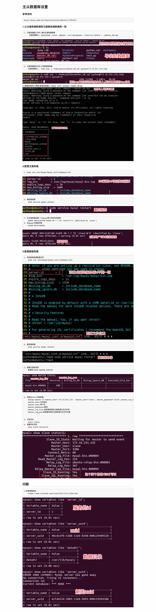

# 数据库高级用法

[toc]

## 1、视图

### 1.1 视图的概念和作用

- 概念

    - 视图就是一个能够把复杂SQL语句的功能封装起来的一个虚表。

    > 视图是对若干张基本表的引用，一张虚表，只查询语句执行结果的字段类类型和约束，不存储具体的数据(基本表数据发生了改变，视图也会跟着改变)
    >
    > 有点像Python中的视图对象，比如说字典的`.keys()`返回的对象，会随着对象本身的变化而变化

- 作用

    - 简化复杂的SQL语句

### 1.2 视图的使用

#### 1.2.1 定义视图

- 定义视图时建议以`v_`开头

- 基本语法

    ```sql
    -- 同基本表的表结构一致，视图在保存基本表字段信息的时候字段不能重复
    -- 因此需要对select结果击中的字段进行重命名
    create view 视图名称 as select;
    ```

    ```sql
    create view v_goods_info 
    as 
    select goods.name as gname, goods_cates.name as gcname, goods_brands.name as gbname from goods
    inner join goods_cates on goods.cate_id = goods_cates.id
    inner join goods_brands on goods.brand_id = goods_brands.id;
    ```

#### 1.2.2 视图操作

- 创建的视图也会存在里

    ```sql
    -- 查看视图
    show tables;
    ```

- 查询

    ```sql
    select * from v_goods_info;
    ```

- 删除视图

    ```sql
    drop view 视图名称;
    ```

<br>
<br>
<br>

## 2、事务

### 2.1 视图的概念和作用

- 概念

    - 事务(Transaction): 是指作为一个基本工作单元执行的一系列SQL语句操作，**要么完全地执行，要么完全地都不执行**。

> 事务只针对数据的增删改，而不能控制表、数据库的操作。

- 作用

    - 银行中的每次交易都必须打包在一个事务中，任何一个步骤失败，必须滚回所有的步骤

### 2.2 事务的四大特性ACID

- 原子性(Atomicity)

    - 一个事务必须被视为一个不可分割的最小工作单元。对于一个事务来说，不可能只执行其中的一部分操作。

- 一致性(Consistency)

    - 数据库总是从一个一致性的状态转换到另一个一致性的状态。

- 隔离性(Isolation)

    - 一个事务所做的修改在最终提交以前，对其他事务是不可见的。

        > 相当于给一条数据加了一个锁，在事务中处理的数据就会被加锁。

- 持久性(Durability)

    - 一旦事务提交，其所做的修改会永久保存到数据库。

### 2.3 事务的使用

- 必须使用`innodb`引擎的数据库才能使用事务
    
    ```sql
    -- 使用sql语句查看数据库引擎
    show create table 表名;
    ```

1. 开启事务

    - 开启事务后执行修改命令，变更会维护到本地缓存中，而不维护到物理表中

    ```sql
    begin;
    或则
    start transaction;
    ```

2. 提交事务

    - 将缓存中的数据变更维护到物理表中

    ```sql
    commit;
    ```

3. 滚回事务

    - 放弃缓存中变更的数据，表示事务执行失败，应该回到开始事务前的状态

    ```sql
    rollback;
    ```

### 2.4 注意点

- 修改数据的命令会自动的触发事务，包括insert、update、delete

- 在mysql命令行中会自动提交事务，所以当我insert语句执行完成后没有commit数据库也看到了提交的数据。

- 当我们不需要mysql命令行自动提交的时候 键入`set autocommit=0`即可

- SQL语句中有手动开启事务的原因是：可以进行多次数据的修改，如果成功一起成功，否则一起会滚到之前的数据

- 不可撤销的操作（隐式提交）: 除了对表数据insert/update/delete语句之外的绝大多数语句都是不能撤销的，比如数据库、表结构的操作，大家可以动手验证。

<br>
<br>
<br>

## 3、索引

### 3.1 索引的概念和作用

- 概念

    - 索引是一种特殊的文件(InnoDB数据表上的索引是表空间的一个组成部分)，他们包含着对数据表里所有记录的位置信息。

        > 通俗地理解，数据库索引好比是一本书前面的目录，能加快数据库的查询速度

- 作用

    - 当数据库中的数据量很大时，查找数据会变得很慢，可以使用索引来提高数据库的查询效率。

- 索引的原理

    - 通过不断的缩小想要获得数据的范围来筛选出最想要的结果，同时把随机的事件变成顺序的事件。

    - 底层是使用**链表**进行处理

> 索引的副作用:
>
> 1. 要注意的是，建立太多的索引将会影响**更新**和**插入**的速度
>
> 2. 建立索引会占用磁盘空间

### 3.2 索引的使用

- 查看表中已有的索引

    ```sql
    show index from 表名;
    ```

- 创建索引

    - 如果指定字段是字符串，需要指定长度(建议长度与定义字段时的长度一致)。

    - 字段类型如果不是字符串，可以不填写长度部分

    ```sql
    create index 索引名称 on 表名(字段名称(长度))
    ```

- 删除索引
    
    ```sql
    drop index 索引名称 on 表名;
    ```
    
    ```sql
    -- 开启运行时间检测以查看索引的效果
    set profiling=1;

    -- 查看详细的执行时间
    show profiles;
    ```

<br>
<br>
<br>

## 4、账户管理

### 4.1 MySQL账户管理

> root用户数据数据库系统中的超级管理员，有权限对MySQL进行任何操作(包括用户权限操作)。

- MySQL账户体系：根据账户所具有的权限不同，MySQL的账户可以分为：

    - 服务实例级账号：该账号可以删除所有的数据库、联通这些库中的表
    
    - 数据库级别账号：对特定数据库执行增删改查的所有操作

    - 数据表级别账号：对特定表执行增删改查等所有操作

    - 字段级别账号：对某些表的特定字段进行操作

    - 存储程序级别账号：对存储程序进行增删改查的操作

### 4.2 账户权限操作

#### 4.2.1 查看所有用户

- `Host`字段表示允许访问的主机

- `User`字段表示用户名

- `suthentication_string`表示密码，为加密后的值

    ```sql
    -- 用户表存在在mysql数据库中
    use mysql;

    -- 查看user表结构
    desc user;
    
    -- 查看所有用户
    select host,user,authentication_string from user;
    ```
    


#### 4.2.2 创建账户、授权

- 常用的权限主要包括：create、alter、drop、insert、update、delete、select

- 所有权限：all privileges

    ```sql
    -- 创建账户、授权
    grant 权限列表 on 数据库 to '用户名'@'访问主机' identified by '密码';

    -- 例：
    grant select on jing_dong.* to 'laowang'@'localhost' identified by '123456';
    ```
    
    - 如果在`@`后面`%`表示此账户可以使用任何ip的主机登录访问此数据库

    - 也可以在`@`后面写localhost和具体的ip，表示允许本机或特定主机访问

#### 4.2.3 查看用户权限

- 查看

    ```sql
    show grants for laowang@localhost;
    ```

#### 4.2.4 修改权限

- 修改

    ```sql
    grant 权限名称 on 数据库 to '账户'@'访问主机' with grant option;

    -- 刷新权限
    flush privileges;
    ```

#### 4.2.5 修改密码

- 使用password()函数进行密码加密

    ```sql
    update user set authentication_string=password('新密码') where user='用户名';

    --  例
    update user set authentication_string=password('123') where user='laowang';

    -- 刷新权限
    flush privileges;
    ```

#### 4.2.6 远程登录(危险)

- 修改MySQL的配置文件

    ```
    bind-address  = xxx.xxx.xxx.xxx
    ```

    - 修改完后重启服务

    ```sh
    sudo service mysql restart
    ```

#### 4.2.7 删除用户

- 语法1 
    
    ```sql
    drop user '用户名'@'主机';

    -- 例：
    drop user 'laowang'@'%';
    ```

- 语法2

    ```sql
    delete from user where user='用户名';

    -- 例
    delete from user where user='laowang';

    flush privileges;
    ```

<br>
<br>
<br>

## 5、主从配置

### 5.1 主从配置的概念和作用

- 概念

    - 主从同步是的数据可以从一个数据库服务器复制到其他服务器上，一个服务器充当主服务器(master)，其余的服务器充当从服务器(slave)。

- 作用

    - 提供服务可用性

    - 通过增加从服务器来提高数据库的性能，在主服务器上执行写入和更新，在从服务器上向外提供读功能，可以动态地调整从服务器的数量，从而调整整个数据库的性能。

    - 提高数据安全，因为数据已复制到从服务器，从服务器可以终止复制进程，所以，可以在从服务器上备份而不破坏主服务器相应数据

### 5.2 主从配置设置步骤



			
