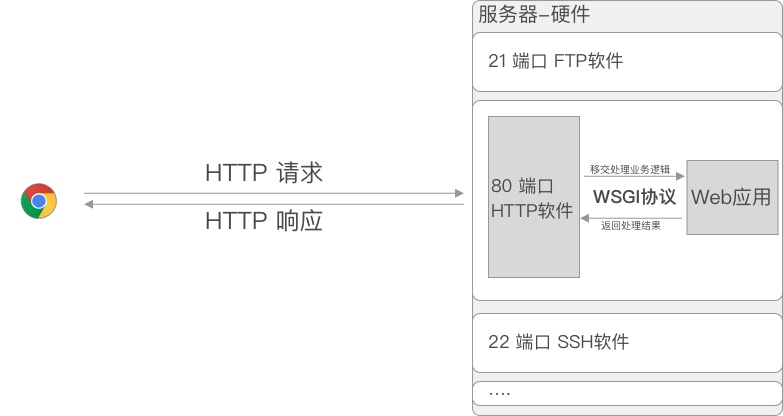
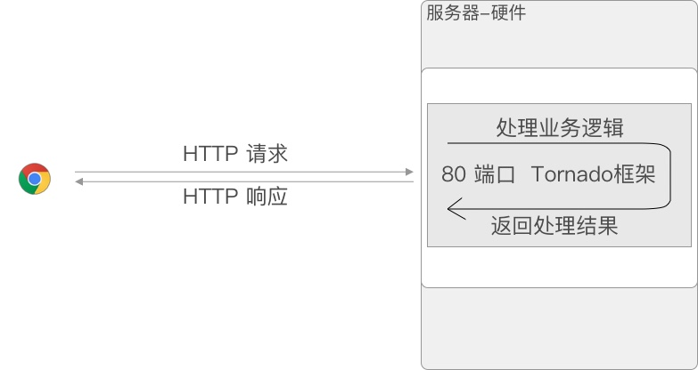
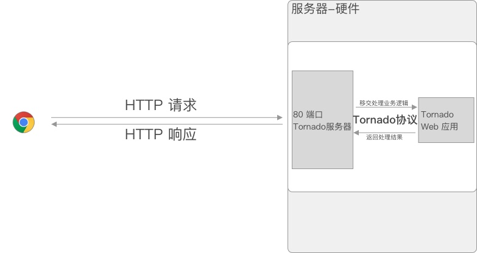
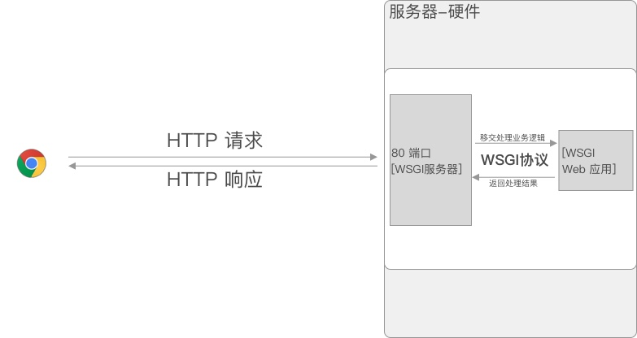
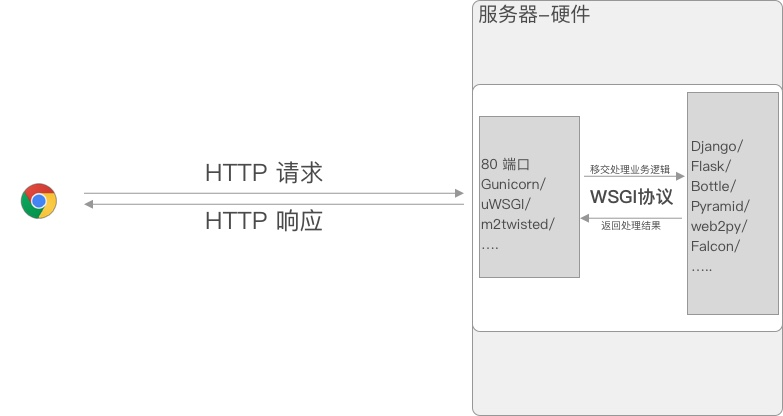
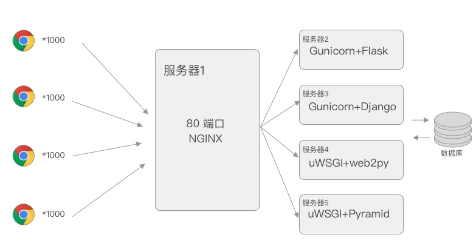

# 尝试理解Flask源码 之 搞懂WSGI协议

## 1. 小记

最近在学习Flask这个Web框架, 相比于Django, Flask算的上是微型的Web框架了,他只有路由和模板渲染两个功能, 想干别的事都需要使用插件. 好在目前的插件数量也不少, 也不乏一些十分好用的插件, 让Flask在企业Web应用开发中还是有一席之地的(我听说知乎就是用的Flask+tornado).

> [Flask插件网站](http://flask.pocoo.org/extensions/)

这一路学下来, 基本上就会写一些视图函数, 完成简单的业务逻辑, 对于框架**执行流程**其实知道得很少, 仅仅是对路由机制有一点点的了解.

> Flask的路由机制主要依赖Werkzeug.routing模块, 主要是`Map`类, `Rule`类, `MapAdapter`类等提供的功能

于是一直想看看Flask的源码, 对这个框架进行进一步的研究, 但是无奈实在看不懂, **不知道从何看起**是最大的问题.

于是我自己一直尝试寻找切入点, 好让我理清看源码的思路, 接下来我就主要记录一下自己的琢磨过程, 这个思考琢磨的过程对我一个新手开发者来说很重要.

我想:

1. 一个Web应用都是从**接受请求**开始, 通过分析请求, 匹配对应的路由规则, 再去调用视图函数, 返回响应结果的, 那么Flask中接受请求的入口在哪里?

2. 由于Flask是遵守WSGI协议的, WSGI协议是Python中的一种Web规范, 一定有大家**共同遵守**的规则, 那么WGSI协议中, 大家遵守的规则是什么?

3. 通过大家都遵守的规则, 也许就能找到Flask中处理请求的入口在哪里了. 同时, 任何遵循这个协议框架的请求入口都能找到.

> 实际上这个思考过程并没有这么顺理成章, 我在学习Flask之前就看过相关WSGI的介绍, 无奈也不是特别能理解. 
>
> 但是当先去了解了某些概念后, 以后再别的地方再次碰到这个问题, 首先就知道去哪里查相关资料了, 这个时候再问题为导向去学习新的知识的时候就会理解的快得多, 并且当理解之后就会融会贯通.

那第一步就是研究一下究竟什么是WSGI.

## 2. WSGI

WSGI全称Web Server Gateway Interface, 不要被名字唬住, 先看这么一句话一起体会一下WSGI是什么:

> This document specifies a proposed standard interface between web servers and Python web applications or frameworks, to promote web application portability across a variety of web servers.

这句话来自[PEP3333](#ref)的摘要部分, 简单翻译一下就是

> 这份文档(指的就是PEP3333)详细说明了Web服务器和Web应用之间的**标准接口**, 旨在提升Web应用的**可移植性**

这里面的关键字就是:

- **可移植性**: 这是WSGI存在的目的

- **标准接口**: 这是WSGI定义的规则

如果知道了WSGI的目的, 理解后续的内容就轻松不少, 那我们就先讲一下WSGI的目的, 理解一下**可移植性**的含义吧

### 2.1 WSGI协议的作用

当我们访问某个网站的时候:
    
1. 浏览器作为用户代理为我们发送了HTTP请求

2. 这条请求经过长途的跋涉终于找到了能够接受它的**服务器**

3. 服务器上的**HTTP服务器软件**会将请求交给**Web应用**处理该请求,得到用户想要的数据

4. **Web应用**再将数据交给**HTTP服务器软件**, 再由**HTTP服务器软件**返回响应结果

5. 浏览器接受到响应, 显示响应内容

这里面一共出现了三个角色, 分别是:

1. **服务器**: 硬件层面, 也就是机房里面的计算机(或者集群), 运行着操作系统+一些软件.

2. **HTTP服务器软件**: 运行在服务器上的软件, 用于监听客户端请求,将接受到的请求交给Web应用, 再将Web应用的响应结果返回给客户端.

3. **Web应用**: 也是在服务器上运行的软件, 接受服务器软件传过来的请求, 处理请求, 并返回处理后的结果给服务器软件.(我们的Flask, Django都是这个层面的)

由于服务器硬件咱们也没什么好说的, 因此接下来提到的服务器(包括HTTP服务器)指的都是**HTTP服务器软件**.

> 对于初学者来说服务器好像就是硬件嘛, 和软件没有关系, 但实际上, 服务器既可以指硬件, 也可以指软件. [维基百科](https://zh.wikipedia.org/wiki/%E6%9C%8D%E5%8A%A1%E5%99%A8).

基本上就是这么一回事:



那WSGI协议的作用在这里就是连接服务器软件和Web应用的**桥梁**, 这两方规定一系列协议, 要求两者之间传输的数据对方都能**看得懂**.

那这么做有什么好处呢?其实就是上面说的可移植性了, 如果对可移植性还是不太理解也没有关系, 下面让我们来看看这里面一个问题.

**既然服务器软件和Web应用都可接受请求, 返回请求, 为什么搞这么复杂?非要搞个协议, 接受请求,处理请求和返回请求的都是一个人不可以么?我和我交流还需要协议么?**

没错, 上一个人也是这么想的, 而且事实上, 我们确实可以这么做.接下来我们来看一下三种模型, 来更好的理解一下WSGI协议和可移植性

#### 2.1.1 第一种模型 - tornado

tornado是由F打头的404网站收购并且开源出来的Web框架, 他的第一个特点奏是将**HTTP服务器**和**Web应用**整合到了一起, 第二个特点如果百度过的基本上都看到过, 异步, 非阻塞, 高性能之类的. 其实, 这个第二个特点说是他的**HTTP服务器**部分

所以可以用tornado搭建出来的服务器模型如下



这就是我们刚才说的**接受请求, 处理请求, 返回请求**都是一个人, 感觉也不错.

但是请注意了, 虽然**表面上**看起来这好像是一个人处理的, 但是我们在编写处理业务逻辑的代码时, 肯定不会去碰服务器相关的代码, 只需要写好视图和路由就可以了, 因此对于tornado来说, 他的**服务器**部分和**逻辑处理**部分还是分开的. 这就相当于虽然是一个人, 但是他的手和大脑是**两个部分**. 



实际上长这样

这里有两个问题, 如果我不想用tornado这个框架写逻辑部分, 那么我也一定不能使用它的服务器部分. 如果我就想用它的Web框架, 想换一个性能更加强大的服务器(软件), 似乎也做不到, 谁叫他们是**一个人**呢!

这就是所谓的**没有可移植性**

> 请注意:
>
> 实际上, tornado的服务器和Web框架是兼容WSGI协议的, 有兴趣的话可以自己搜索一下相关内容.举这个例子是因为在Python Web框架中, tornado实现了高性能的HTTP服务器仅此而已.
>
> tornado服务器擅长处理多个长连接, 可以用于在线聊天等业务场景.

#### 2.1.2 第二种模型 - WSGI服务器+Web框架

终于轮到WSGI出场了.

对于一个遵守WSGI协议的服务器和Web应用来说, 它并不在意**到底是谁传过来的数据**, 只需要知道**传过来的数据符合某种格式**, 两边都能处理对方传入的数据. 

> 打个比方, 你特别特别想吃水饺, 于是请了俩人, 一个人专门擀面皮, 一个人专门包饺子, 由于擀面皮的人动作比较快, 他还要负责把包好的饺子拿过来下锅, 这样你才能吃到水饺.
>
> 第一人擀面皮的时候需要遵守**饺子协议**, 一定要把面皮擀成圆的(没错, 馄饨皮就是方的!), 并且皮还不能太大, 太厚, 这样第二个人才能保证包出饺子来. 
>
> 同样的, 第二个人也要遵守**饺子协议**, 再拿到饺子皮后使用灵巧的手法捏出造型各异的水饺, 但是他包的一定是饺子, 不能是一坨我们看不懂的东西!
>
> 第二个人把包好水饺拿给第一个去下饺子, 好在这二人都遵守了**饺子协议**, 第一个人一看, 不错, 这家伙包出的的确是饺子, 那我也保证我能够最后最后煮熟的东西是水饺了.
>
> 最后, 你吃到了水饺, 但是这两人始终也不认识对方, 如果在这个过程中你换了另一个遵循**饺子协议**的人, 他与另一个人还是能够紧密合作.

于是我们可以搭建像这样的模型:



目前被广泛应用的WSGI服务器(又称为**WSGI容器**), 主要有`gunicorn`和`uWSGI`.[完整列表](https://wsgi.readthedocs.io/en/latest/servers.html)

而遵循WSGI协议的python web框架有`Django`, `Flask`, `Pyramid`, `web2py`, `Bottle` 等等等.[完整列表](https://wsgi.readthedocs.io/en/latest/frameworks.html)

最终, 我们有:



随便怎么组合都可以, 怎么样, 是不是**可移植性**更强了?

#### 2.1.3 第三种模型 - 最终形态

然而在真正的生产环境中, 以我们上面的模型是完全扛不住很多人一起访问的, 于是就有了服务器集群的概念, 使用一个性能更好的服务器打头阵, 然后它所做的事情就是把接收到的请求再分发给其他计算机去处理.

> 这就好像后来你开了个饺子馆, 为了能够接待更多的人, 你必须再雇对几个包饺子的组合. 当然, 还必须有一个收银人员.

这里拿[NGINX](https://zh.wikipedia.org/wiki/Nginx)来举例



在这个模型中, 我们的WSGI服务器起到了承上启下的作用, 它只处理NGINX丢给他的请求.

当然, 这也不意味着我们对WSGI服务器性能要求不高了, 因为真正去调用Web应用的还是WSGI服务器, 我们只不过使用NGINX去实现了**负载均衡**.

其实第三种形态远没有这么简答. 我了解的也不是很多, 但是到了这里, 我们应该已经完全理解了WSGI协议的**目的**了. 那接下来就来看一下WSGI协议到底指定了哪些规则吧!

> 了解过部署的朋友可能知道还有另一个高性能的服务器-Apache, 但是通过阿帕奇与WSGI应用的交互似乎是通过阿帕奇自带的模块去进行的
> 
> [How to use Django with Apache and mod_wsgi](https://docs.djangoproject.com/zh-hans/2.1/howto/deployment/wsgi/modwsgi/)

### 2.2 WSGI协议简单分析

WSGI协议这么厉害!那一定很难实现吧!

其实WSGI协议内容没有这么神秘, 也特别容易实现, 它只是一系列**简单的规则**, 这个规则有多简单呢, 一会儿我们用3行代码就可以写完一个简单的WSGI应用, 而且不需要导入任何模块和包.

由于涉及服务器与Web应用交互, WSGI的规则分为两个部分, 分别对WSGI服务器端和WSGI应用端做了要求. 作为Web后端开发人员, 我们和框架(应用)打交道, 只需要了解WSGI协议对应用的要求.(我才不会说我也没有看服务器端的协议内容)

假设现在已经有了一个WSGI服务器, 现在需要编写一个WSGI应用, 那么我们的应用该如何和服务器进行交互呢?

换句话说, 我们的应用需要*接受*什么样的数据, 需要*返回*什么样的数据呢?

OK, 让我们把WSGI应用端规则罗列一下:

1. Web应用必须是一个**可调用对象**, 它必须*接受***两个参数**

2. 其中第一个参数是`environ`(字典类型), 另一个参数是`start_response`(函数)

3. 需要在返回响应之前调用`start_response`

4. 最终*返回*的一个**可迭代对象**

> 什么?你问我什么是可调用对象, 什么是可迭代对象?不如去问问[他](https://www.liaoxuefeng.com/wiki/0014316089557264a6b348958f449949df42a6d3a2e542c000/00143178254193589df9c612d2449618ea460e7a672a366000)吧.

这两个参数的具体内容为:

1. `environ` 本次请求的所有内容, 我挑了几个看着眼熟的感受一下.
    
    ```python
    {
        ...
        'REQUEST_METHOD': 'GET',
        'RAW_URI': '/',
        'SERVER_PROTOCOL': 'HTTP/1.1',
        'HTTP_HOST': '127.0.0.1:5000',
        'HTTP_CONNECTION': 'keep-alive',
        'HTTP_ACCEPT': 'text/html,application/xhtml+xml,application/xml;q=0.9,image/webp,image/apng,*/*;q=0.8',
        'HTTP_ACCEPT_LANGUAGE': 'zh-CN,zh;q=0.9,en;q=0.8',
        'REMOTE_ADDR': '127.0.0.1',
        'REMOTE_PORT': '62445',
        'PATH_INFO': '/',
        ...
    }
    ```

2. `start_response`函数, 返回数据**之前**需要调用, 用于设置**状态码**和**响应头**

    - 注意, 调用`start_response`函数时, 第一个参数用于设置状态码, 是一个字符串

    - 第二个参数用于设置响应头, 要注意该参数的格式(见下方代码).

根据这些个规则, 我们很容易些出一个遵循WSGI协议的Web应用:

```python
# 1. 必须是一个**可调用对象**, 它必须接受**两个参数**
def demo_app(environ,start_response):
    # 2. 其中第一个参数是`environ`(字典类型), 另一个参数是`start_response`(函数)

    # print(environ)

    # 3. 返回之前调用一次start_response  返回状态码和响应头, 注意参数格式, 不同的请求头信息用元组隔开
    start_response("200 OK", [('Content-Type','text/html')])  
    
    # 4. 返回一个可迭代对象, 这里就是最终的响应体
    return ["b<h1>Hello WSGI!</h1>"]  
```

是不是很简单? 排除注释一共就只有3行代码.

至此, 我们就看完了WSGI协议应用端的部分. 那么现在, 来看一下Flask中的WSGI是怎么体现的吧

> 上面的函数是一个完全符合WSGI协议的函数, 因此他就可以作为一个WSGI应用, 你甚至可以将它跑起来!
>
> 如果你已经安装了Gunicorn, 将上述代码保存, 并命名为`my_app.py`, 你只需要将终端切换到该文件所在的路径下, 然后输入
>
> `gunicorn -b127.0.0.1:5000 my_app:demo_app`
>
> 就可以正常运行起来, 此时用浏览器访问127.0.0.1:5000, 就能看到返回的结果!
>
> 你也可以将print所在行注释掉, 看一下environ里面包含的完整信息
>
> **注意: Gunicorn只支持类Unix系统! 不支持Windows!**

### 2.3 Flask中的WSGI

我们知道了, 遵循WSGI协议的应用一定是一个可调用对象, 所以它既可以是一个函数, 也可以是一个实现了`__call__()`方法的类.

话不多说, 上源码

```python
class Flask(_PackageBoundObject):
    .....

    def __call__(self, environ, start_response):
         return self.wsgi_app(environ, start_response)
    ...
```

我们轻松找到了Flask中处理请求的入口, 但是, 它又调用了另一个方法, 趁热打铁, 让我们来看一下这个方法.

```python
class Flask(_PackageBoundObject):
    ...

        def wsgi_app(self, environ, start_response):
            ctx = self.request_context(environ)
            error = None
            try:
                try:
                    ctx.push()
                    response = self.full_dispatch_request()
                except Exception as e:
                    error = e
                    response = self.handle_exception(e)
                except:
                    error = sys.exc_info()[1]
                    raise
                return response(environ, start_response)
            finally:
                if self.should_ignore_error(error):
                    error = None
                ctx.auto_pop(error)

    ...
```

这个就是Flask中真正请求的入口了, 在兜里一个圈子后, 最终将两个参数传给了`wsgi_app()`这个方法, 并交由它来处理. 

所有的请求就将会在这**几行**代码中处理完成, 并且最终返回. 只要搞懂了这**几步**, 就能知道Flask是怎么处理请求的啦! 

看上去很轻松, 但实际上的步骤还是相当复杂的, 我会慢慢尝试去理解, 一旦有有所收获也会第一时间更新.

如果有什么问题可以私信我, 内容有错误也欢迎大家帮我纠正!

<span id="ref"></span>

> 参考文章
>
> 1. [Python Web开发最难懂的WSGI协议，到底包含哪些内容](http://python.jobbole.com/88653/)
>
> 2. [WSGI接口 - 廖雪峰的官方网站](https://www.liaoxuefeng.com/wiki/0014316089557264a6b348958f449949df42a6d3a2e542c000/001432012393132788f71e0edad4676a3f76ac7776f3a16000)
>
> 3. [PEP 3333](https://www.python.org/dev/peps/pep-3333/)

> 吐槽一下: 这个PEP 3333是WSGI协议的第二个版本(1.0.1)了, 第一个版本(1.0.0)记录在PEP 333中. 这个pep命名方式也是很厉害的
